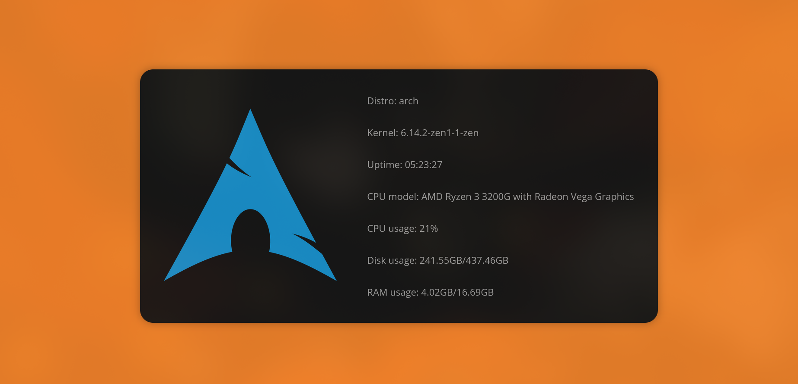

# Ensomnatt's hyprland dotfiles

**OS:** [Arch Linux](https://archlinux.org/)  
**WM:** [Hyprland](https://hyprland.org/)  
**Bar:** [Waybar](https://github.com/Alexays/Waybar)  
**Terminal:** [Wezterm](https://wezterm.org/)  
**Code editor:** [Neovim](https://neovim.io/)  
**App launcher:** [rofi](https://github.com/davatorium/rofi)   
**Browser:** [Zen Browser](https://zen-browser.app/)  
**Notifications daemon:** [dunst](https://github.com/dunst-project/dunst)   
**Colors:** [Hellwal](https://github.com/danihek/hellwal)  
**Logout app:** [Wlogout](https://github.com/ArtsyMacaw/wlogout)  
**File manager:** [yazi](https://github.com/sxyazi/yazi)  
**Webfetch:** [Webfetch](https://github.com/ensomnatt/webfetch)     
**Shell:** [zsh](https://www.zsh.org/)

## Installation

copy the files in your .config  
wallapapers should be placed in the ~/pictures/wallpapers  
if you use a different path, don't forget to update it in the config files
if you want to install my neovim config, check out it here https://github.com/ensomnatt/neovim-config

## Note 

i haven't tested this setup on other machines - so use at your own risk.

about 70% of the config comes from other users - i was too lazy to write everything from scratch

if someone decides to use this, i'd love to hear your feedback.

bye!
