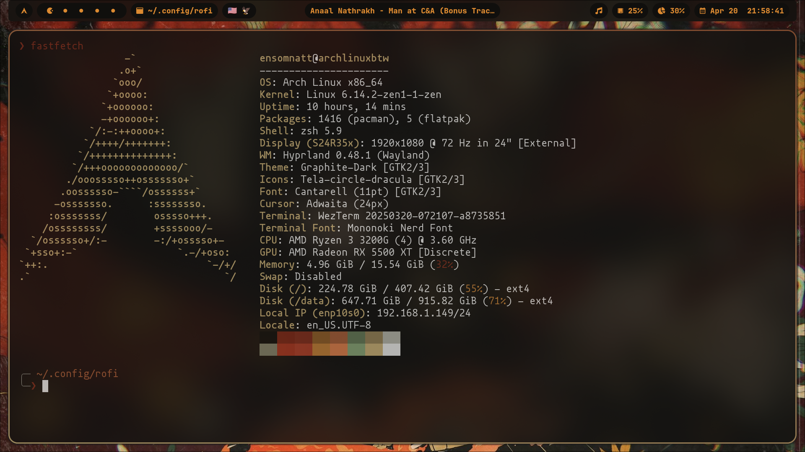
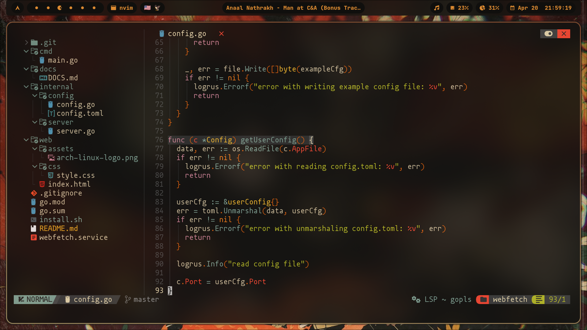
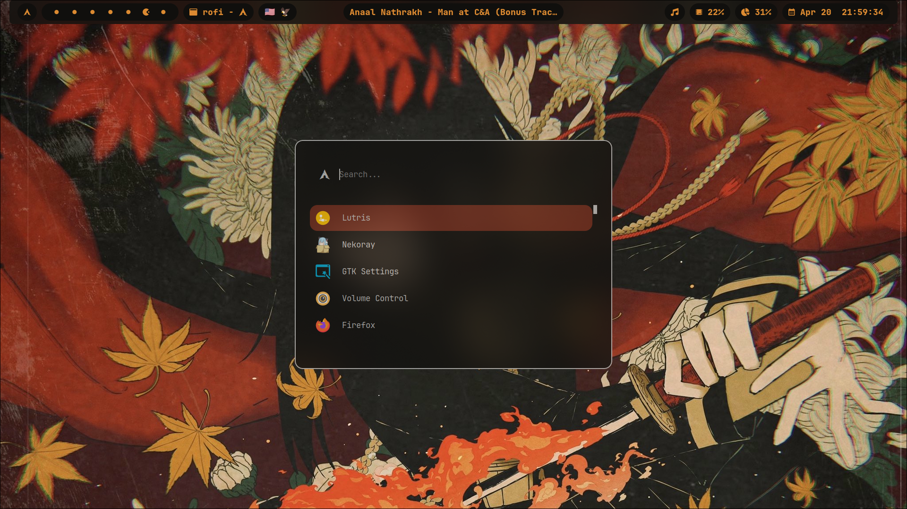

# Ensomnatt's hyprland dotfiles

OS: Arch Linux
WM: Hyprland
Bar: Waybar
Terminal: WezTerm
Code editor: Neovim
App launcher: rofi 
Browser: Zen Browser
Video player: mpv 
Notifications daemon: dunst 
Colors: pywal16
Logout app: Wlogout
File manager: yazi

## Installation

copy the files in your .config  
wallapapers should be placed in the ~/pictures/wallpapers  
if you use a different path, don't forget to update it in the config files
if you want to install my neovim config, check out it here https://github.com/ensomnatt/neovim-config

## Note 

i haven't tested this setup on other machines - so use at your own risk.

about 70% of the config comes from other users - i was too lazy to write everything from scratch

if someone decides to use this, i'd love to hear your feedback.

bye!
